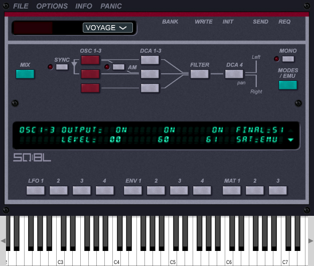

# SQ8L



This project is a remake of the famous SQ8L VST plugin. It uses a reverse engineered version of the original audio 
engine and JUCE as an application/plugin wrapper.

## Build instructions

```bash
mkdir build && cd build
cmake ..
cmake --build .
```

## TODO

The following list is not exhaustive:

- [ ] Sysex message handling
- [ ] Global options
- [ ] LCD popup parameter selection
- [ ] Dials
- [ ] Preset loading and saving

## Known issues

- Hard voice stealing is broken
- Reverse engineered filter is not fully accurate
